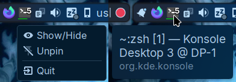
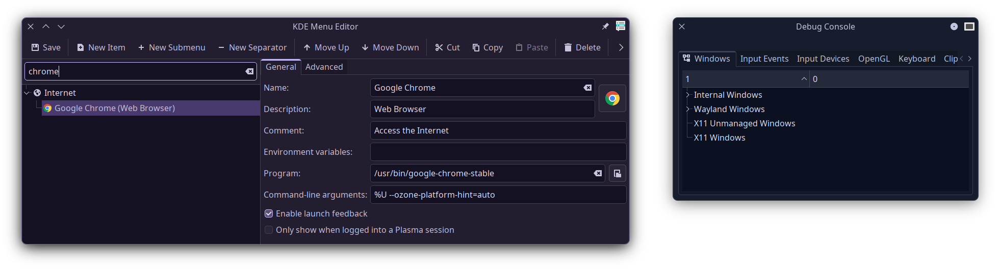

# KWin Minimize2Tray

**This is work in progress, don't expect feature parity with other implementations right away**

Hide windows to the system tray, similar to [KDocker](https://github.com/user-none/KDocker) but in the form of a KWin Script that works on KDE Plasma 6.0+ Wayland.



> [!IMPORTANT]
> Some applications like Google Chrome or Chromium/Electron based may run in Xwayland mode and have issues hiding from taskbar or minimizing on startup, enabling native Wayland support for them can help. Usually setting an environment variable or command-line argument with KDE's `kmenuedit` is needed, refer to [Wayland - ArchWiki](https://wiki.archlinux.org/title/Wayland#GUI_libraries) or search "linux APP_NAME enable wayland support".
>
> To verify if an application is running on Xwayland instead of Wayland use the KWin Debug Console.
> 

## Features

- Wayland support (X11 hasn't been tested but was [confirmed to work](https://github.com/luisbocanegra/kwin-minimize2tray/issues/25))
- Should work with windows from any application **as long as they are minimizable**
- Windows are hidden from Task Manager (taskbar), Task Switcher (Alt+Tab), Desktop Pager and restored when clicking on the tray icon
- Per application visibility can be configured from System Tray widget configuration
- Application and window status
  - [Unity LauncherAPI](https://wiki.ubuntu.com/Unity/LauncherAPI)
    - Counter: Top-right corner (optional dot style can be enabled from KWin script settings)
    - Progress bar: Green bottom bar
    - Urgent: Sets *[NeedsAttention](https://api.kde.org/plasma-types.html#ItemStatus-enum)* status of icon

    **Note:** Unity LauncherAPI doesn't specify a window so all the tray icons from the same application will get the same status

  - *[Demands attention](https://invent.kde.org/plasma/kwin/-/blob/fc98b4bcbd80ba025994c2d31244d984a253ec66/src/window.h#L429)* from KWin will also set *[NeedsAttention](https://api.kde.org/plasma-types.html#ItemStatus-enum)* status of icon and works per window.

## Installation

Proper distribution packages will be available eventually, for now you can install it manually.

**You will need to install any required dependencies**, see [#9 Note build dependencies](https://github.com/luisbocanegra/kwin-minimize2tray/issues/9)

```sh
git clone https://github.com/luisbocanegra/kwin-minimize2tray.git
cd kwin-minimize2tray
./install.sh
```

### Immutable distributions

1. Run `./install-immutable.sh` to install
2. Add `QML_IMPORT_PATH` environment variable for the C++ plugin to work:

    Create the file `~/.config/plasma-workspace/env/path.sh` (and folders if they don't exist) with the following:

    ```sh
    export QML_IMPORT_PATH="$HOME/.local/lib64/qml:$HOME/.local/lib/qml:$QML_IMPORT_PATH"
    ```

3. Log-out or reboot to apply the change

## Configuration/Usage

Enable/disable

1. *Minimize to tray* from *System Settings* > *Window Management* > *KWin Scripts*

By default the shortcut is set to `Meta+Alt+PgDown`, to change it:

1. *System Settings* > *Keyboard* > *Shortcuts*
2. From the list on the left select *KWin*
3. Search for "Minimize window to tray" and change it to whatever you prefer

> [!IMPORTANT]
> Due to a limitation in KWin, you will need to log out and back in after changing the configuration of the script for it to work properly.

## Acknowledgements

[Unity LauncherAPI](https://wiki.ubuntu.com/Unity/LauncherAPI) implementation is a simplified version of [KDE/plasma-desktop/applets/taskmanager/plugin/smartlaunchers](https://github.com/KDE/plasma-desktop/tree/e3ba92b113d8a4e2d47a589835e9d867059dc2b9/applets/taskmanager/plugin/smartlaunchers)

## Support the development

If this project has been useful to you, consider sponsoring or donating so I can dedicate more time to maintain and improve this and [my other open source work](https://github.com/luisbocanegra?tab=repositories&q=&type=source&language=&sort=stargazers)

[](https://github.com/sponsors/luisbocanegra)
[](https://ko-fi.com/luisbocanegra)
[](https://www.buymeacoffee.com/luisbocanegra)
[](https://www.paypal.com/donate/?hosted_button_id=Y5TMH3Z4YZRDA)
[](https://patreon.com/luisbocanegra?utm_medium=unknown&utm_source=join_link&utm_campaign=creatorshare_creator&utm_content=copyLink)
